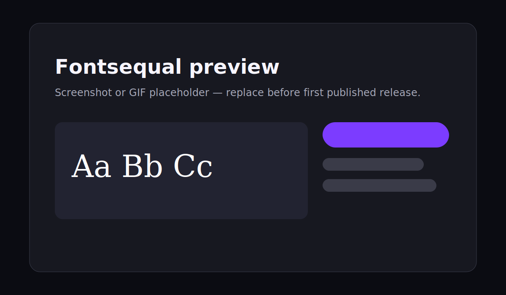

<div align="center">

# Fontsequal

### A local-first desktop font manager for designers, developers, and brand teams.

[](../../actions/workflows/ci.yml)
[](LICENSE)


<!-- Replace with an exported product screenshot or GIF before first release. -->


</div>

> **Pre-release project.** No GitHub releases are published yet. Build from source while v0.1.0 is prepared.

## Features

| Browse and preview | Local library | Safe management |
| --- | --- | --- |
| Search and filter font families | Scan TTF/OTF metadata and hashes | User-scope managed installs only |
| Typography lab with presets and comparison | Detect duplicate files | Managed-only uninstall protection |
| Google Fonts cache and previews | Import local font copies | Linux Fontconfig cache refresh |
| Favorites and collections | Filter system, external, and managed fonts | SQLite-backed local settings |

## Safety first

Fontsequal is built around ownership boundaries.

- It installs only into Fontsequal-managed **user** font folders.
- System-wide font installation is **not included in the MVP**.
- It copies imported fonts; it never moves original files.
- Fontsequal only uninstalls fonts it manages.
- System and external fonts are read-only in Fontsequal.
- Data stays local. Cloud sync is planned for a later release.

## Quick start

Arch Linux example:

```bash
sudo pacman -S --needed bun rustup base-devel webkit2gtk-4.1 gtk3 libappindicator-gtk3 librsvg fontconfig
rustup default stable

git clone https://github.com/fontsequal/fontsequal.git
cd fontsequal
bun install
bun run tauri:dev
```

Managed fonts live at:

- Linux: `~/.local/share/fonts/fontsequal`
- Windows: `%LOCALAPPDATA%\Fontsequal\fonts`

## Build from source

Requirements: Bun, Rust stable, and Tauri platform dependencies.

```bash
bun install
bun run typecheck
bun run lint
bun run test
bun run tauri:build
```

## Why Fontsequal?

| | Fontsequal | Typical system font folders | Cloud font services |
| --- | --- | --- | --- |
| Local-first library | Yes | Partial | Usually no |
| Safe managed uninstall | Yes | Manual and risky | Varies |
| System font protection | Yes | No ownership context | Varies |
| Typography comparison tools | Yes | No | Varies |
| Cloud sync | Planned | No | Usually yes |

## Roadmap

- [x] Local scanning, import, managed install, and safe uninstall
- [x] Google Fonts cache, previews, favorites, collections, and settings
- [x] Windows and Linux build targets
- [ ] Published installers and signed release artifacts
- [ ] Provider-neutral unified font index
- [ ] Optional cloud sync, with explicit opt-in

## Contributing

Contributions welcome. Read [CONTRIBUTING.md](CONTRIBUTING.md) before opening a pull request. Use Bun only for frontend tooling and keep all font operations local and user-scoped.

## Security

Report vulnerabilities privately. See [SECURITY.md](SECURITY.md). Never include API keys or personal file paths in public reports.

## License

Fontsequal is released under the [MIT License](LICENSE).
